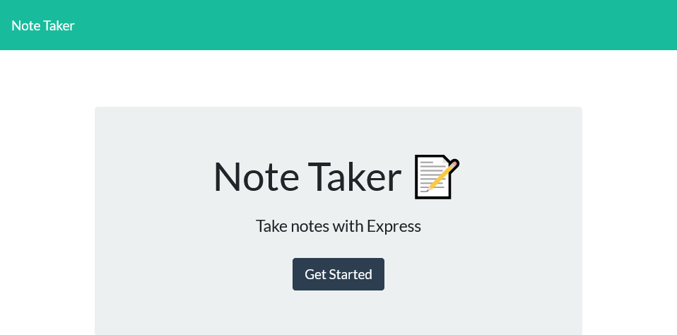
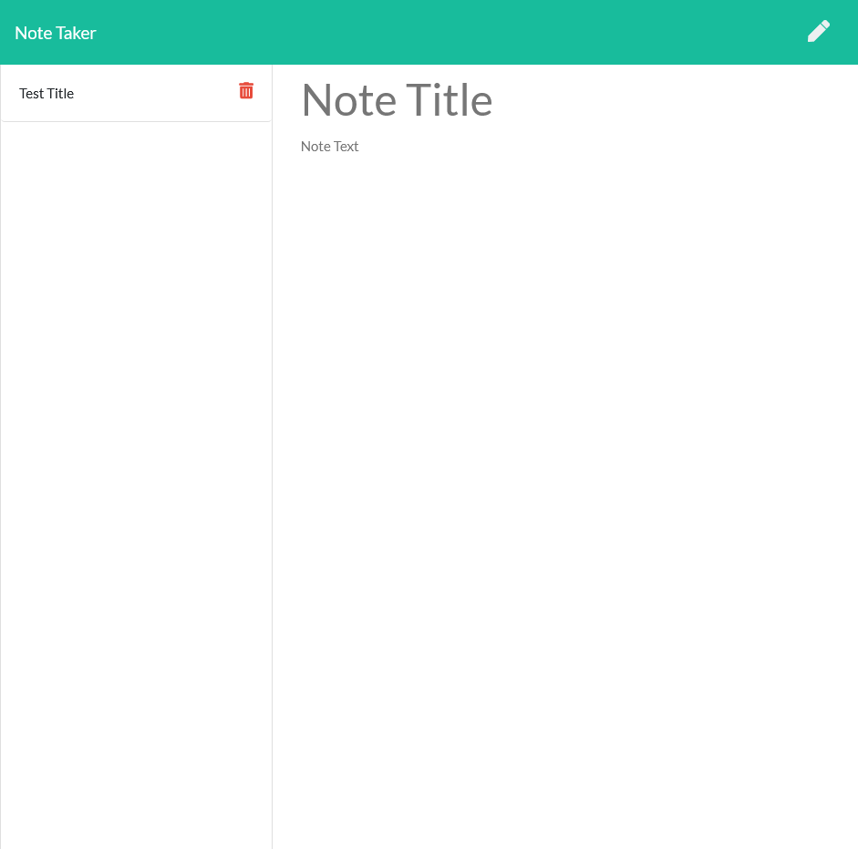
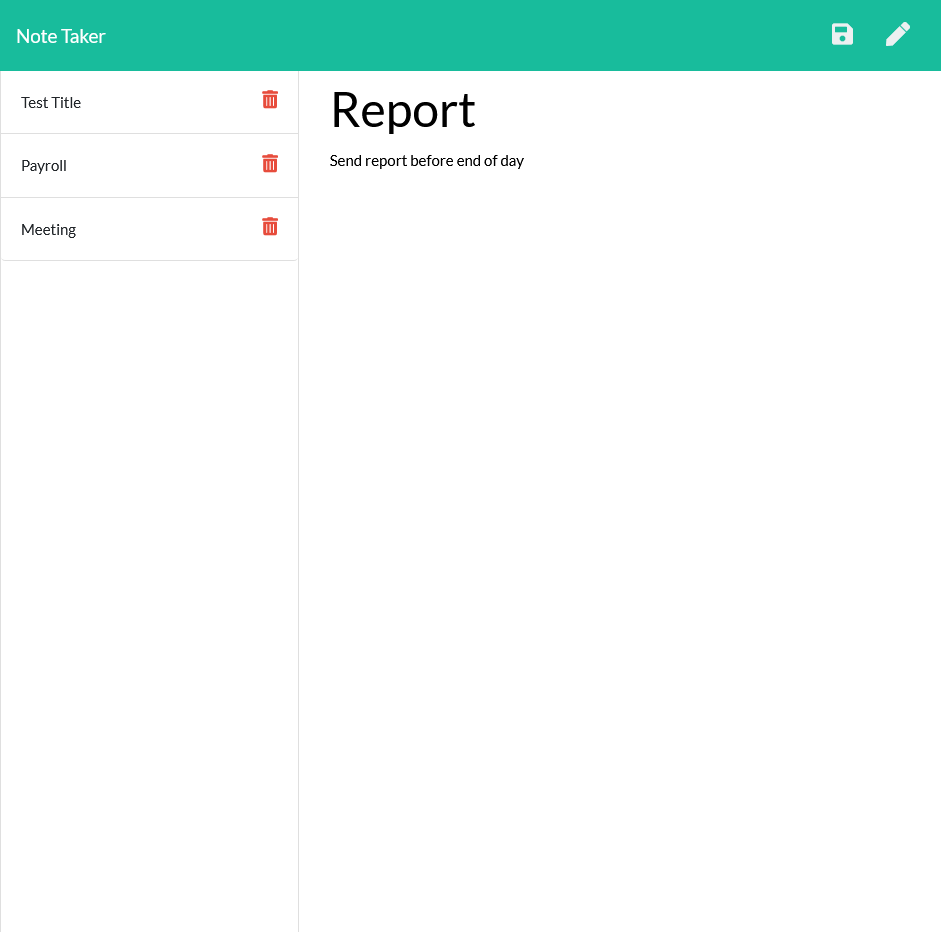
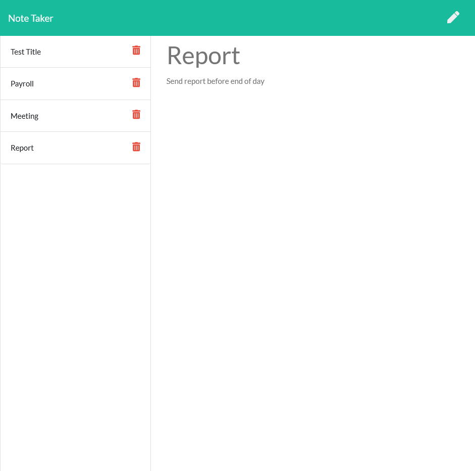

# Note_Taker
## Code Description
This application uses Node.js and Express in order to save a users notes to a backend server deployed on Heroku. There are static HTML and CSS files that are used to as a foundation for the function and style of the application. This application is dependent on the npm packages of Express and UUID. A Dev dependency of Nodemon was also used in order to test the functionality of the server before deploying the code. The majority of the work for this repo was performed on the server.js file to get a working server going that allows the frontend to communicate with the backend.

## Live Link
https://mysterious-falls-92295.herokuapp.com/

## Function
This application functions by first presenting a home page to the user with a "Get Started" button. When the user clicks on the button, they are taken to the notes page which will either display a test note or previously entered notes since the last time the server was started. 

The user should input a title in the "Note Title" placeholder and further details into the "Note Text" placeholder. Once both placeholders have been filled with the user input, a save icon appears in the top right of the page next to the pencil icon. The save icon allows the user to save the current note, while the pencil icon allows the user to start a new note. Once a note has been added to the list on the left, the user may click on the title of the note to read it although there is no edit functionality. If a red trash can icon next to a note title is clicked, this deletes the note from the database.

## Installation
1. Git clone the repository onto the user machine.
2. Run npm init and then npm install where the application was cloned. 
3. In order to have full functionality, a server must be running. This application was developed using Node and has been deployed on Heroku.

## Screenshots
### Home Page 

### Note Page

### New Note

### Saved Note
